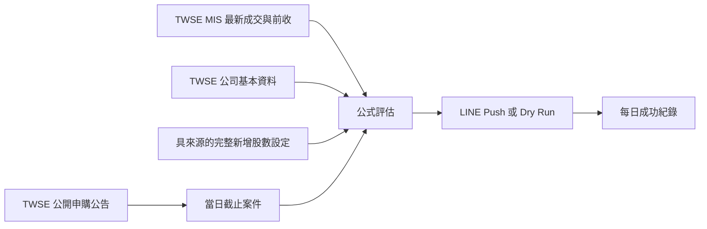

# 台股申購提醒

每天在台股公開申購截止日執行規則篩選，將結果或「今日無符合標的」
狀態透過 LINE 傳給一位或多位使用者。專案使用免費官方資料與 GitHub Actions
免費額度，不需要付費行情或主機。

## 已實作功能

- 取得證交所公開申購日程，僅處理當日截止且未取消的普通股案件。
- 取得 MIS 最新成交價、前一交易日收盤價及報價時間。
- 顯示目前股價、前收、漲跌金額及漲跌幅。
- 每檔符合條件股票附上對應的 Goodinfo 公告資訊連結。
- 計算市價折價率、承銷價帳面報酬率、發行規模及安全邊際。
- 嚴格區分完整股數稀釋率與公開申購規模下限。
- 有標的、無標的及整體資料失敗使用不同 LINE 訊息。
- 動態讀取所有 `LINE_TARGET_ID_<ALIAS>`，每位收件者獨立發送。
- 單一收件者失敗不阻止其他人，備援排程只重試尚未成功者。
- 紀錄只保存 alias 與 SHA-256 userId 雜湊，不保存原始 userId。
- 08:10 與 11:10（Asia/Taipei）兩次免費排程；每日成功標記避免重複發送。
- 所有憑證只從環境變數或 GitHub Secrets 讀取。

## 計算規則

```text
市價折價率 = (目前股價 - 實際承銷價) / 目前股價 × 100%
承銷價帳面報酬率 = (目前股價 - 實際承銷價) / 實際承銷價 × 100%
今日漲跌幅 = (目前股價 - 前一交易日收盤價) / 前一交易日收盤價 × 100%
完整股數稀釋率 = 整次新增發行股數 / (目前已發行普通股數 + 整次新增發行股數) × 100%
安全邊際 = 市價折價率 - 發行規模百分比
```

預設推薦條件是：

```text
市價折價率 > 20%
安全邊際 > 10 個百分點
```

門檻是嚴格大於，剛好等於不會入選。

## 資料流程



## 完整新增股數

證交所公開申購表的「實際承銷股數」只代表公開申購部分，不一定是整次
現金增資的全部新增股數。為避免低估稀釋，預設 `DILUTION_POLICY=strict`。

在 `config/issuance-overrides.json` 依股票代號加入經官方公告確認的資料：

```json
{
  "1234": {
    "totalNewShares": 10000000,
    "sourceUrl": "https://official.example/announcement"
  }
}
```

若暫時只想探索，可設定：

```text
DILUTION_POLICY=public-offering-proxy
```

此模式會使用公開申購股數計算下限，LINE 會明確警告它可能低估整次發行
影響，不應視為完整稀釋率。

## 本機執行

需要 Node.js 24：

```powershell
npm install
npm run check
npm run dry-run
```

Dry run 不需要 LINE 憑證，也不會發送訊息。

可使用環境變數重跑特定日期：

```powershell
$env:EVALUATION_DATE="2026-07-22"
$env:DILUTION_POLICY="public-offering-proxy"
npm run dry-run
```

`EVALUATION_DATE` 只影響該次執行。正式排程未提供日期時仍使用台北當日；
`public-offering-proxy` 會在訊息中明確標示並警告可能低估稀釋。

真實發送前，複製 `.env.example` 的變數到執行環境並設定：

- `LINE_CHANNEL_ACCESS_TOKEN`
- 至少一個 `LINE_TARGET_ID_<ALIAS>`，例如：

```text
LINE_TARGET_ID_ADAM=Uxxxxxxxx
LINE_TARGET_ID_FAMILY=Uyyyyyyyy
```

後綴會轉成紀錄 alias，例如 `LINE_TARGET_ID_TEAM_ALPHA` 會記錄為
`Team Alpha`。空值會忽略，重複 userId 會使程式 fail closed。程式本身
不限制收件者數量。
- `DRY_RUN=false`

不要提交 `.env` 或任何 token。

## GitHub Actions

在 Private Repository 的 Settings → Secrets and variables → Actions 加入：

- `LINE_CHANNEL_ACCESS_TOKEN`
- `LINE_TARGET_ID_001`
- `LINE_TARGET_ID_002`（有第二位收件者時）

Workflow 預留 `001` 至 `005` 五個槽位。若需要更多人，可繼續在 workflow
的 `env` 加入 `LINE_TARGET_ID_006` 等 Secret；GitHub Actions 不會自動把
所有 Repository Secrets 注入程式，因此每個 Secret 名稱仍需明確列出。

Workflow 使用 UTC cron，對應台灣時間：

- `10 0 * * 1-5`：08:10
- `10 3 * * 1-5`：11:10 備援

手動執行時可另外指定 `evaluation_date` 與 `dilution_policy`，用來重跑歷史
日期或驗證 LINE 版面；排程執行固定採當日與 `strict`。

主要排程成功後會提交 `data/run-history.json`，只記錄每位收件者的 alias、
SHA-256 雜湊及成功時間。備援排程只發送給當天尚未成功的收件者，因此正常
情況每人只會收到一則 LINE。建議在 GitHub Billing 將 Actions 額外付費預算
設為零。

## 免費額度與限制

- GitHub Free 私有專案目前包含每月 Actions 免費分鐘；本專案每天兩次、
  每次上限十分鐘，但實際通常只需數十秒。
- LINE 輕用量方案目前每月包含 200 則免費訊息；五位收件者每月約
  100～115 則，仍應在 LINE 後台確認當期方案與實際用量。
- GitHub cron 是 best-effort，可能延遲，不能保證固定分鐘送達。
- MIS 免費資訊用於個人、低頻提醒；本專案不提供公開行情轉傳服務。
- 尚未自動解析承銷公告或公開說明書中的整次新增股數。
- 本工具是規則型資訊提醒，不構成投資建議，也不保證撥券時仍有價差。

## 驗證

```powershell
npm run check
```

目前涵蓋公式、嚴格門檻、缺少完整新增股數、proxy 警告、民國日期、台北
時區，以及包含目前股價與每日漲跌的通知格式。
