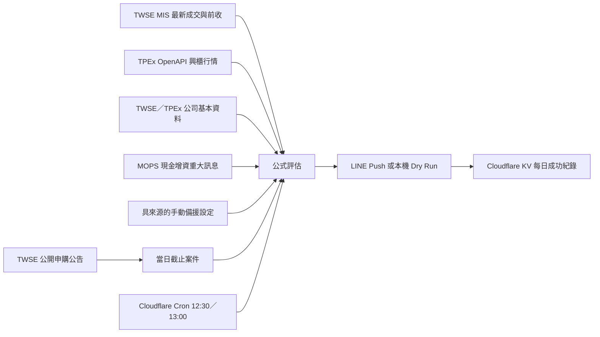

# 台股申購提醒

每天在台股公開申購截止日執行規則篩選，將結果或「今日無符合標的」
狀態透過 LINE 傳給一位或多位使用者。正式排程由 Cloudflare Worker 直接
執行，不經 GitHub Actions 排程；專案使用免費官方資料與 Cloudflare Free
plan，不需要付費行情或常駐主機。

## 重要免責聲明與合法使用

本專案僅提供技術示範、學習與個人資訊整理用途，不構成證券投資分析、
投資顧問、招攬、推薦、交易訊號或任何獲利保證。所有篩選結果都可能因
資料延遲、錯誤、缺漏、價格變動或規則限制而失真；使用者應自行查證官方
原始資料、評估風險並對自己的行為與投資決策負責。作者不對任何直接或
間接損失負責。

請遵守目標網站的使用條款與 `robots.txt`，僅用於學習或合法用途。公開
Repository、原始碼或免責聲明不代表取得第三方網站、即時行情、公告內容
的自動存取、重製、改作、散布或商業利用授權；`robots.txt` 也不是完整的
法律授權。使用前應自行確認各資料來源當時有效的條款、API/data license、
著作權、交易資訊管理規範及所在地法律。若要公開營運、向第三人提供個股
篩選結果、收費、商業使用或轉傳行情，應先取得資料權利人同意並諮詢合格
法律專業人士。

截至 2026-08-03 的檢查結果：

- TWSE 網站使用條款限制未經同意的自動化下載，交易資訊另有使用管理與
  授權規範；應優先使用明確允許的官方 OpenAPI／開放資料介面。
- MOPS `robots.txt` 對一般 User-Agent 設為 `Disallow: /`。依目前使用者決定，
  程式仍會以低頻率嘗試查詢；此設定不代表已取得網站授權。若收到拒絕存取、
  網站政策改變或需要停止查詢，可設定 `ENABLE_MOPS_FETCH=false` 立即停用。
- Goodinfo 在本專案中只作為使用者自行點擊的外部超連結，程式不爬取其
  頁面。使用連結後仍應遵守 Goodinfo 當時有效的條款與 `robots.txt`。
- 櫃買中心一般網站禁止未經同意的自動化擷取；興櫃行情只使用政府資料
  開放平臺列出、採政府資料開放授權條款第 1 版的櫃買中心 OpenAPI，
  不解析行情網頁 HTML。
- 法規與網站政策會變動；公開或部署前必須重新檢查，不能只依賴本段文字。

## 已實作功能

- 取得證交所公開申購日程，僅處理當日截止且未取消的普通股案件。
- 上市／上櫃案件取得 MIS 最新成交價、前一交易日收盤價及報價時間。
- 初上市等案件在 MIS 尚無資料時，從櫃買中心 OpenAPI 取得興櫃最近
  成交價、前一交易日平均價及資料時間。
- 預設從公開資訊觀測站重大訊息取得整次現金增資新增股數，並可透過
  `ENABLE_MOPS_FETCH=false` 停用。
- 顯示目前股價、前收、漲跌金額及漲跌幅。
- 每檔符合條件股票附上對應的 Goodinfo 公告資訊連結。
- 計算市價折價率、完整股數稀釋率及安全邊際。
- 不以公開申購股數替代整次新增股數。
- 有標的、無標的及整體資料失敗使用不同 LINE 訊息。
- 動態讀取所有 `LINE_TARGET_ID_<ALIAS>`，以單次 LINE multicast 發送同一
  訊息，避免收件者數量耗盡 Cloudflare subrequest 額度。
- multicast 整批失敗時不寫成功紀錄，備援排程會完整重試待送批次。
- 紀錄只保存 alias 與 SHA-256 userId 雜湊，不保存原始 userId。
- 12:30 主排程與 13:00 備援排程（Asia/Taipei）；Cloudflare KV 的每日成功
  標記避免重複發送。
- 13:15 後拒絕傳送過期申購資訊，即使排程延遲也不會在收盤後誤送。
- 所有憑證只從本機環境變數、GitHub Secrets 或 Cloudflare encrypted
  secrets 讀取。

## 計算規則

```text
市價折價率 = (目前股價 - 實際承銷價) / 目前股價 × 100%
上市／上櫃今日漲跌幅 = (目前股價 - 前一交易日收盤價) / 前一交易日收盤價 × 100%
興櫃較前日均價 = (最近成交價 - 前一交易日平均價) / 前一交易日平均價 × 100%
完整股數稀釋率 = 整次新增發行股數 / (目前已發行普通股數 + 整次新增發行股數) × 100%
安全邊際 = 市價折價率 - 發行規模百分比
```

完整資料的推薦條件是：

```text
市價折價率 > 20%
安全邊際 > 10 個百分點
```

門檻是嚴格大於，剛好等於不會入選。

若能取得實際承銷價及可用市價，而且市價折價率大於 20%，但缺少整次
新增發行股數或已發行普通股數，仍會列為「價差符合、發行資料不足」。
此類股票會顯示所有已成功取得的資料，包括原已發行普通股數；只有實際
缺少的新增股數、發行後總股數、稀釋率或安全邊際欄位保留空白。不會用
公開申購股數冒充完整發行資料。

行情降級規則：

- 有目前成交價、無前收：仍評估折價率；漲跌幅顯示無法計算。
- 無目前成交價、有前收：使用前收作為可用市價並明確標示。
- 目前成交價與前收都沒有：列入資料不完整。
- 初上市等案件若 MIS 無資料，改查具政府開放資料授權的櫃買中心興櫃
  OpenAPI；其資料每日更新，因此訊息會明確顯示資料時間，不冒充即時價。
- 所有行情來源都缺值時，仍保留案件類型、承銷價、公開承銷股數及撥券
  日期；原已發行普通股數或整次新增股數只要有一項成功取得也會顯示。
  只有需要行情的折價率與推薦判定停止。
- 實際承銷價不存在：列入資料不完整。

## 資料流程



## 完整新增股數

證交所公開申購表的「實際承銷股數」只代表公開申購部分，不一定是整次
現金增資的全部新增股數。程式預設依股票代號查詢公開資訊觀測站「精華版」
及對應重大訊息，解析整次發行總股數，再搭配公司基本資料計算發行後總股數。
若需停止 MOPS 查詢，設定 `ENABLE_MOPS_FETCH=false`。自動查詢仍須由操作者
自行承擔並確認網站條款、授權與使用風險。

重大訊息候選標題支援「現金增資認股基準日」、「董事會決議辦理……現金
增資發行新股」及「初次上市前現金增資發行新股承銷價格」。程式會依序讀取
候選公告，找不到完整發行總股數時繼續嘗試下一則，不會把公開申購配售股數
誤認為整次增資股數。

解析會優先鎖定公告第 5 項「發行總金額及股數」，支援「發行總股數」、
「本次發行股數」、「發行股數」、「發行普通股」及「發行新股」等常見
寫法，並換算股、千股、仟股、萬股及億股。限定總發行區段可避免誤抓員工
認股或公開承銷的部分股數。

若 MOPS 公告格式暫時無法解析，可在 `config/issuance-overrides.json`
依股票代號加入經官方公告確認的備援資料；備援設定優先於自動查詢：

```json
{
  "1234": {
    "totalNewShares": 10000000,
    "sourceUrl": "https://official.example/announcement"
  }
}
```

## LINE 成功訊息格式

完整發行資料存在時：

```text
【台股申購提醒｜2026-07-23】

執行成功
今日截止：1 檔
完整符合：1 檔
僅價差符合：0 檔
資料不足：0 檔

1234 範例
判定：完整符合
申購截止：今天
撥券日期（上市／上櫃日期）：2026-07-30
公開承銷股數：10,000 股

價格時間：2026/07/23 10:30:00
目前股價：100 元
前一交易日收盤價：95 元
今日漲跌：+5.00 元（+5.26%）

實際承銷價：60 元
市價折價率：+40.00%

原已發行普通股數：90,000 股
本次新增股數：10,000 股
發行後總股數：100,000 股
股數稀釋率：10.00%
安全邊際：30.00 個百分點

公告資訊：https://goodinfo.tw/tw/StockAnnounceList.asp?STOCK_ID=1234

提醒：以上為規則篩選結果，不代表保證獲利。
```

缺少完整發行資料時，仍會顯示股票，但以下欄位保留空白：

```text
原已發行普通股數：90,000 股
本次新增股數：
發行後總股數：
股數稀釋率：
安全邊際：
```

資料不完整區塊會列出股票代號、名稱、案件類型、申購截止日、撥券日期、
實際承銷價、公開承銷股數、原已發行普通股數、整次新增發行股數、可計算
的發行後股數與稀釋率、具體原因及對應 Goodinfo 網址。每個無法取得的欄位
明確顯示「資料不足」。

## 本機執行

需要 Node.js 24：

```powershell
npm install
npm run check
npm run dry-run
```

Dry run 不需要 LINE 憑證，也不會發送訊息。

## Cloudflare Worker 正式排程

正式排程定義於 `wrangler.jsonc`，Cron 使用 UTC：

- `30 4 * * MON-FRI`：台灣時間週一至週五 12:30 主執行。
- `0 5 * * MON-FRI`：台灣時間週一至週五 13:00 備援。
- `LATEST_SEND_TIME=13:15`：超過此時間直接失敗且不傳送申購資訊。

Cloudflare 的星期數字以 `1` 代表 Sunday；為避免把 `1-5` 誤認為
Monday-Friday，設定固定使用英文星期名稱。

12:30 成功後，Worker 會用一次 KV put 將所有成功收件者的 SHA-256 雜湊
寫入當日單一紀錄；13:00 用一次 KV get 判斷是否需要補送。KV 不保存原始
LINE userId，紀錄在 120 天後自動刪除。multicast 整批成功才會寫成功紀錄；
若評估或 multicast 失敗，該批不會記成成功，13:00 仍會完整重試。

第一次部署需要先登入並建立 KV namespace：

```powershell
npx wrangler login
npx wrangler kv namespace create ALERT_HISTORY
```

將命令回傳的 namespace id 填入 `wrangler.jsonc` 的 `kv_namespaces`；目前
Repository 已填入本次建立的 namespace id。若改用其他 Cloudflare 帳號，
必須換成該帳號新建的 id。接著將敏感值寫入 Cloudflare encrypted secrets：

```powershell
npx wrangler secret put LINE_CHANNEL_ACCESS_TOKEN
npx wrangler secret put LINE_TARGET_ID_001
```

有其他收件者時繼續設定 `LINE_TARGET_ID_002` 至 `LINE_TARGET_ID_005`。
Secret 只在互動提示中貼上，不能寫入命令列、`.env`、`wrangler.jsonc`、
Repository 或操作紀錄。完成後部署：

```powershell
npm run check
npm run worker:deploy
```

部署完成後可在 Cloudflare Dashboard 的 Worker → Triggers → Cron Triggers
確認兩個排程，並在 Logs 或 `npm run worker:tail` 查看執行結果。公開 HTTP
端點只回傳健康狀態，不提供遠端發送功能。

所有一般資料請求預設依主機至少間隔 1,500 ms，以避免短時間集中存取。
可用 `HTTP_MIN_INTERVAL_MS` 調高間隔；為避免不當高頻請求，低於 500 ms
的設定會直接拒絕執行。節流不等於取得自動存取授權。

可使用環境變數重跑特定日期：

```powershell
$env:EVALUATION_DATE="2026-07-22"
npm run dry-run
```

`EVALUATION_DATE` 只影響該次執行。正式排程未提供日期時仍使用台北當日。
所有執行都只使用完整新增股數計算稀釋率；資料不足時不做替代估算。

真實發送前，複製 `.env.example` 的變數到執行環境並設定：

- `LINE_CHANNEL_ACCESS_TOKEN`
- 至少一個 `LINE_TARGET_ID_<ALIAS>`，例如：

```text
LINE_TARGET_ID_ADAM=Uxxxxxxxx
LINE_TARGET_ID_FAMILY=Uyyyyyyyy
```

後綴會轉成紀錄 alias，例如 `LINE_TARGET_ID_TEAM_ALPHA` 會記錄為
`Team Alpha`。空值會忽略，重複 userId 會使程式 fail closed。程式本身
不限制收件者數量。
- `DRY_RUN=false`

不要提交 `.env` 或任何 token。

## GitHub Actions 手動備援

在 Private Repository 的 Settings → Secrets and variables → Actions 加入：

- `LINE_CHANNEL_ACCESS_TOKEN`
- `LINE_TARGET_ID_001`
- `LINE_TARGET_ID_002`（有第二位收件者時）

在 Variables 可設定：

- `ENABLE_MOPS_FETCH=false`：停止 MOPS 自動查詢。未設定時依目前使用者決定
  預設啟用；啟用不代表已取得網站授權，遇到拒絕存取時不應繞過限制。

Workflow 預留 `001` 至 `005` 五個槽位。若需要更多人，可繼續在 workflow
的 `env` 加入 `LINE_TARGET_ID_006` 等 Secret；GitHub Actions 不會自動把
所有 Repository Secrets 注入程式，因此每個 Secret 名稱仍需明確列出。

GitHub Actions 已移除 `schedule`，避免平台延遲數小時後傳送過期資訊。
現在只保留 `workflow_dispatch`，供人工診斷或歷史資料驗證。手動執行時
可指定 `evaluation_date` 與 `force_resend`，用來重跑
歷史日期或驗證 LINE 版面。`force_resend=true`
會忽略該日期既有成功紀錄並再次傳送，只應用於明確的人工測試；排程執行
固定採當日、`strict` 與不強制重送。

GitHub 手動執行仍沿用 `data/run-history.json`；它與 Cloudflare KV 是兩套
獨立紀錄，因此正式上線後不要以 GitHub workflow 對當日執行真實發送，
除非已確認需要人工補送。建議在 GitHub Billing 將 Actions 額外付費預算
設為零。

## 免費額度與限制

- Cloudflare Workers Free plan 足以容納每天兩次 Cron 的請求量；但免費方案
  CPU 額度有限，部署後仍須以真實 Cron 執行確認資源用量與穩定性。
- GitHub Actions 只保留人工診斷，不再承擔每日準時發送。
- LINE 輕用量方案目前每月包含 200 則免費訊息；五位收件者每月約
  100～115 則，仍應在 LINE 後台確認當期方案與實際用量。
- Cloudflare Cron 同樣不是金融等級 SLA；雙排程、期限防護與執行監控只能
  降低風險，不能保證任何外部平台 100% 不故障。
- Cloudflare Free 每次 invocation 的 subrequest 額度有限。正式 Worker 將
  LINE 發送合併為一次 multicast，並將 KV 操作壓縮為一次讀取及成功後一次
  寫入；新增收件者不會線性增加 LINE 或 KV subrequests。
- MIS 免費資訊用於個人、低頻提醒；本專案不提供公開行情轉傳服務。
- 所有 HTTP 資料請求採每個 host 至少 1,500 ms 的啟動間隔；這只是負載
  保護，不取代目標網站的條款、robots.txt 或授權。
- timeout、HTTP 408／425／429 及 500～504 只會有限重試一次，並遵守最長
  60 秒的 `Retry-After`；403 等明確拒絕不重試，也不繞過封鎖。
- 所有外部請求使用 `redirect: manual`，避免 Cloudflare 自動跟隨未知長度的
  redirect chain 耗盡每次 invocation 的 subrequest 額度。3xx 會當成該來源
  失敗並保留其他已取得資料；「Too many subrequests」不做無效重試。
- 最終失敗會記錄日期、股票代號、來源類型與安全化錯誤摘要，不記錄 LINE
  token、收件者 ID、URL 查詢參數或外部回應內容。Cloudflare Logs 可用
  `official_source_retry` 與 `official_source_failed` 事件篩選問題來源。
- MOPS 頁面或公告文字格式若改版，可能暫時無法解析完整新增股數；此時
  會標示發行資料不足，不會以公開申購股數冒充完整發行股數。
- 本工具是規則型資訊提醒，不構成投資建議，也不保證撥券時仍有價差。

## 驗證

```powershell
npm run check
```

目前涵蓋公式、嚴格門檻、MOPS 重大訊息與完整新增股數解析、缺少完整新增
股數或普通股數時的價差回報、缺少前收時的降級行為、民國日期、台北時區、
Worker 的 12:30／13:00 去重與 13:15 期限防護，以及通知格式。
測試亦涵蓋暫時性來源重試、明確拒絕不重試、安全化錯誤日誌，以及新增
股數缺失時仍保留原已發行普通股數、單次 multicast、合併式 KV 狀態，及
redirect/subrequest 上限防護。
